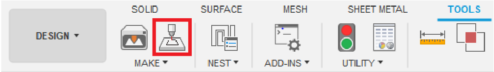

# F360LaserCuttingUtilities
Fusion 360 scripts and add-ins to improve the laser cutting workflow

# ExportBodiesForLaser
This add-in provides a convenient way to export several bodies in an assembly to a single DXF file for laser cutting.

# Installation
[Click here to download the add-in](https://github.com/johntantolik/F360LaserCuttingUtilities/archive/main.zip)

Follow [these instructions](https://knowledge.autodesk.com/support/fusion-360/troubleshooting/caas/sfdcarticles/sfdcarticles/How-to-install-an-ADD-IN-and-Script-in-Fusion-360.html) from Autodesk to install the add-in.

# Usage

The add-in can be accessed through the button created next to the default "3D Print" button in Fusion (and also through a new button in the file menu). After running the command, select the bodies you wish to export for laser cutting. Extraneous bodies that are not flat can be included in the selection; they will be ignored when exporting. The proper faces to laser cut will be automatically detected and a message listing material thicknesses will be generated. This may take a couple minutes for complex models. Finally, specify a location to save the DXF file.

# TODO
- Refine the command dialog, allow users to manually select faces if preferred
- Group the bodies by material thickness and export each group to a separate file
